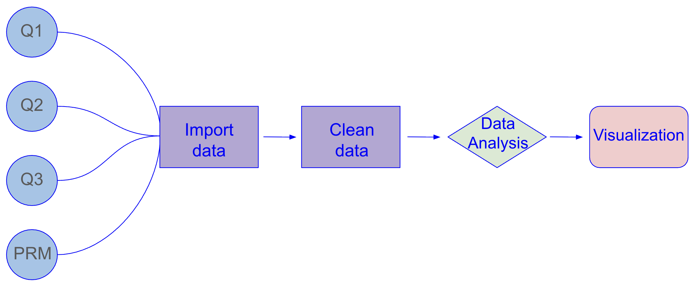

# Hurricane Effects on Stream Chemistry

{width="538" height="247"}

The point of this repository is to show how I reproduced Figure. 3 in (Schaefer et al. 2000) using the same data from the paper in R.

## Content

This repository contains:

-   **data**: Contains Raw data
-   **docs**: Contains rendered paper.html
-   **outputs**: Contains CSVs with cleaned data and (Schaefer et al. 2000) Figure. 3 imitation plot
-   **paper**: Quarto Document shows data analysis and visualization
-   **supporting code**: R scripts for data cleaning and installing packages
-   **scratch**: Contains R scripts that are under development

## Data

This repository contains data from the paper:

-   Schaefer, D. A., McDowell, W. H., Scatena, F. N., & Asbury, C. E. (2000). Effects of hurricane disturbance on stream water concentrations and fluxes in eight tropical forest watersheds of the Luquillo Experimental Forest, Puerto Rico. Journal of Tropical Ecology, 16(2), 189–207. <https://doi.org/10.1017/S0266467400001371>

## Flow Chart

The analysis used in this project is a centered rolling average that is calculated over 9 week intervals. Since the samples were taken on intermiittent days I used the slide_index_dbl() function from the package slider to find the rolling average. This function was preformed on all 4 data sets separately (q1_unique.csv, q2_unique.csv, q3_unique.csv, prm_unique.csv). Once the rolling average was calculated for each contaminant, the data was merged into one big data set, so it can be plotted using a facet_wrap.

### Contributors

-   Austin Martinez
